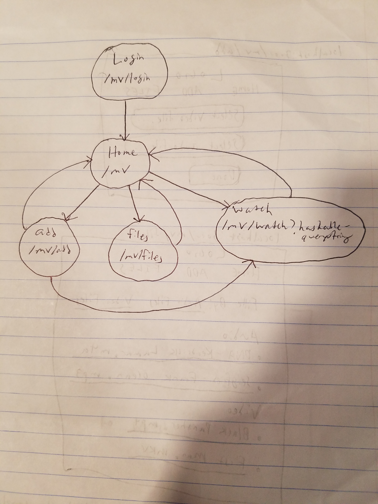

## Overview

Sometimes when you're listening to a song, you can't help but imagine it with a music video. Or, if you're watching a movie or a TV show, you can't help but imagine how it would play out with a backing soundtrack. 

This site allows users to register and login, and then insert both audio (.mp3, .wav, .flac, .alac, .m4a, etc.) and video files (.mp4, .avi, .mkv, etc.) into a database and generates a "music video" where the audio is placed behind a video clip. (Maybe implement a basic editor?). The user can view all of their generated music videos and delete if desired.

## Site map

## User Stories or Use Cases

1. as non-registered user, I can register a new account with the site
2. as a user, I can log in to the site
3. as a user, I can view a list of all my previously generated files
4. as a user, I can watch all my previously generated files
5. as a user, I can add personal files to site
6. as a user, I can view all of inserted audio and video files
