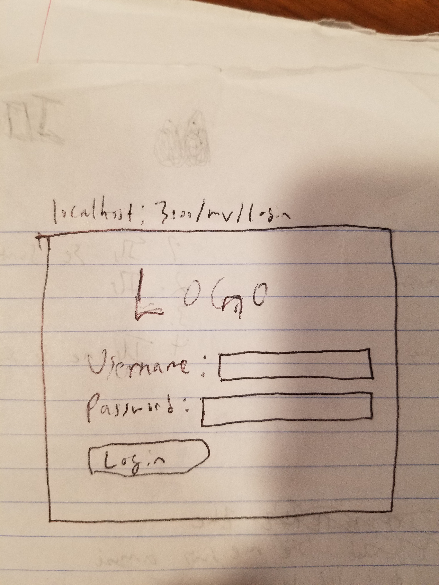
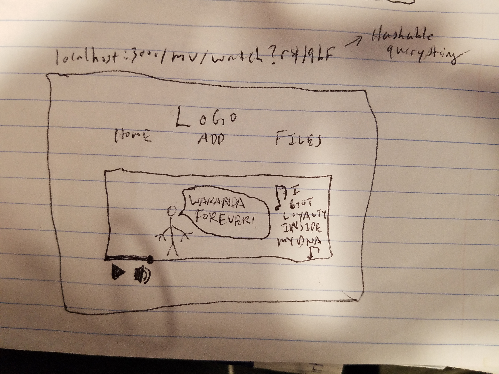
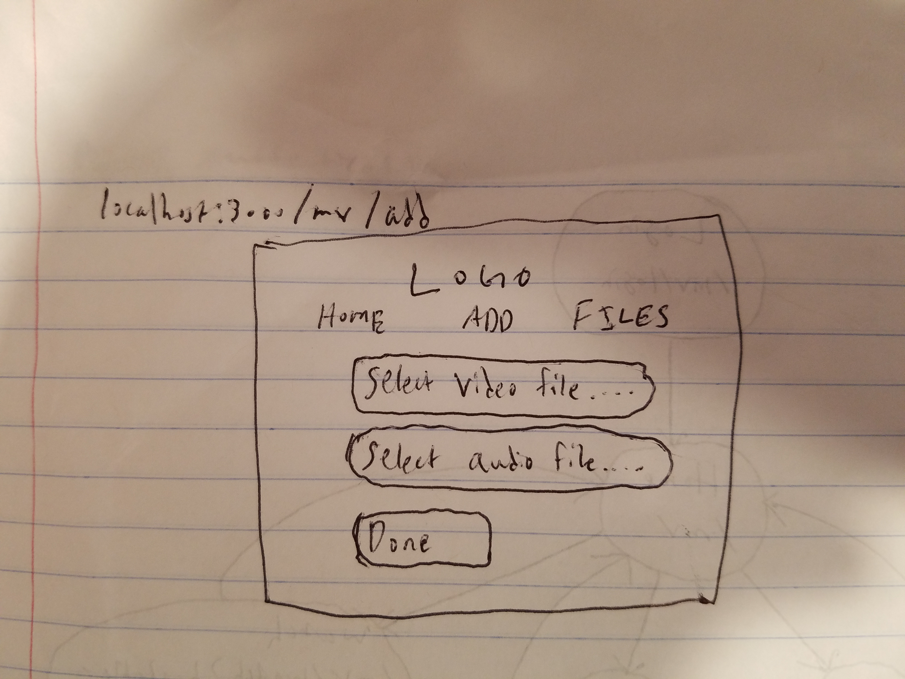
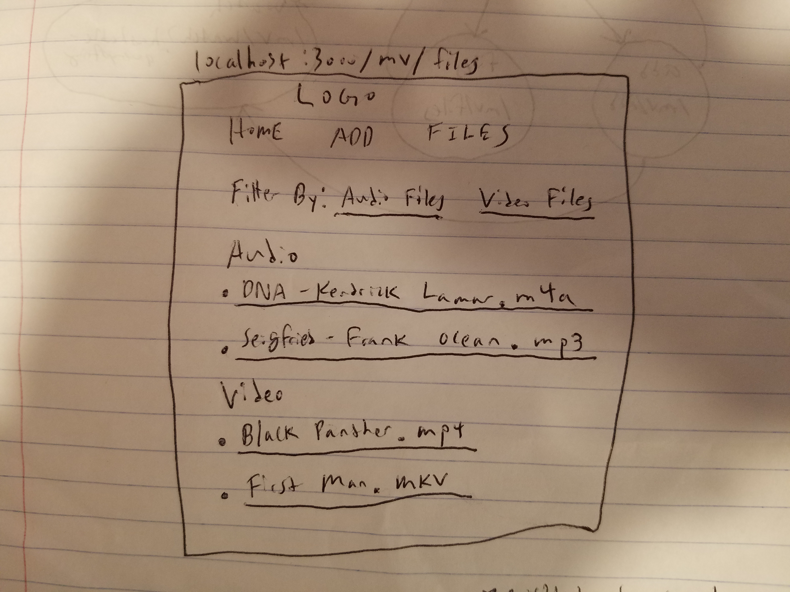
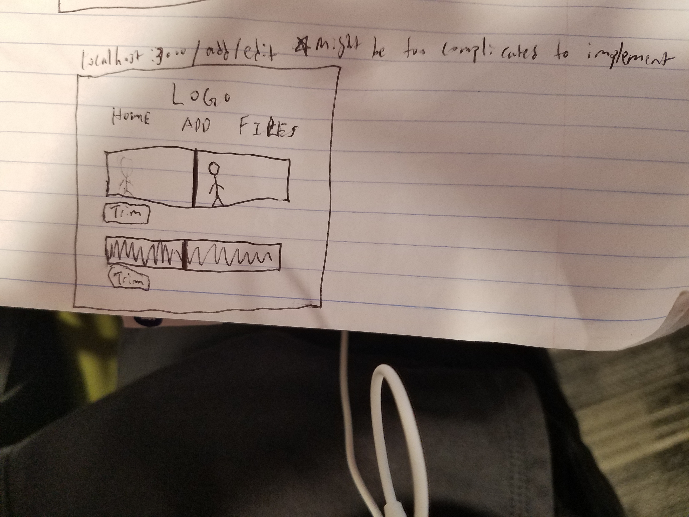

# final-project

## Overview

Sometimes when you're listening to a song, you can't help but imagine it with a music video. Or, if you're watching a movie or a TV show, you can't help but imagine how it would play out with a backing soundtrack. 

This site allows users to register and login, and then insert both audio (.mp3, .wav, .flac, .alac, .m4a, etc.) and video files (.mp4, .avi, .mkv, etc.) into a database and generates a "music video" where the audio is placed behind a video clip. (Maybe implement a basic editor?). The user can view all of their generated music videos and delete if desired.

## Data Model

The application will store Users and 2 different Lists

* each user will have a list of objects containing the generated file and metadata
* each user will also have a list of objects containing the inserted files and metadata

An Example User:

```javascript
{
username: "michaeljordan",
hash: // a password hash,
list: // an array of references to a list document
object: // a reference to an object
}
```

An Example List with Embedded Items:

```javascript
{
user: // a reference to a User object
items: [
{ name: "Black Panther x Kendrick Lamar", // name created by user
date: 2018-11-05 11:05PM // date of creation with timestamp},
{ name: "First Man x Kid Cudi", // name created by user
date: 2018-11-05 11:08PM // date of creation with timestamp},
],
}
```

An Example List with Embedded Items:

```javascript
{
user: // a reference to a User object
items: [
{ filename: "clip1.mp4", // provided by user
date: 2018-11-05 11:05PM // date of insertion with timestamp},
{ filename: "X - Kendrick Lamar.m4a", // provided by user
date: 2018-11-05 11:08PM // date of insertion with timestamp},
],
}
```

## [Link to Commented First Draft Schema](db.js) 

## Wireframes

/mv/login - login page for logging in or creating a new user



/mv - home page which displays all generated files 


/mv/watch?hashable-query-string - page displaying a generated video file



/mv/add - page that allows user to add a video file and an audio file



/mv/files - page that displays all user inserted files



/mv/add/edit - potential page for editing inserted audio and video files



## Site map


## User Stories or Use Cases

1. as non-registered user, I can register a new account with the site
2. as a user, I can log in to the site
3. as a user, I can view a list of all my previously generated files
4. as a user, I can watch all my previously generated files
5. as a user, I can add personal files to site
6. as a user, I can view all of inserted audio and video files
7. as a user, I can potentially edit inserted audio and video files

## Research Topics

    * (5 points) Integrate user authentication
    * (2 points) Bootstrap
    * (4 points) Server-side storage (GridFS)
    * (2 points) Perform client side form validation using a JavaScript library (need to be able to upload files from client side) (Multer)
    * (1 point) HTML/DOM Research (Play video and audio file at the same time while muting video file)

14 points total out of 8 required points

## [Link to Initial Main Project File](app.js) 


